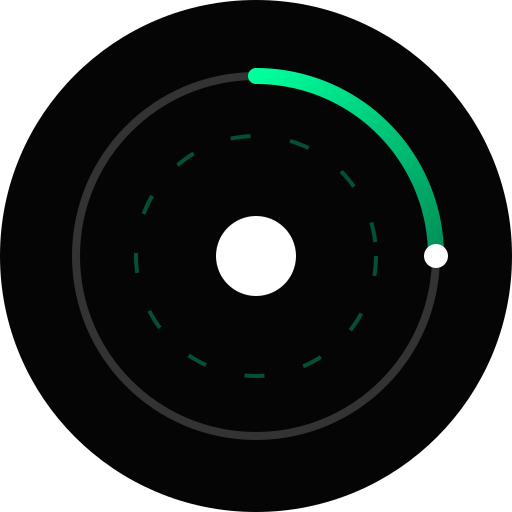

# 🌑 Celestium

Planetary OS

> "We do not watch the clock. We watch the sky."




## 🔭 The Mission
**Celestium** is a rejection of the Gregorian Calendar. It is a spatially-aware coordinate system that replaces arbitrary political labels (Monday, January, 12:00 PM) with raw astronomical telemetry.

It functions as a **Heads-Up Display (HUD)** for the Earth's position in the cosmos, rendering time as 3D geometry rather than a linear sequence.

---

## 📐 The Universal Syntax
Celestium displays time using a precise coordinate vector:

### `Σ :: Ω . α . λ | ρ`

| Symbol | Name | Value | Definition |
| :--- | :--- | :--- | :--- |
| **Σ** | **The Aeon** | `175k` | **Deep Time.** Cycles since the Theia Impact (Moon Formation). |
| **Ω** | **The Epoch** | `358°` | **Axial Precession.** The Earth's wobble. 0° = Perfect Polaris Alignment. |
| **α** | **Solar Arc** | `000-360` | **Orbital Progress.** 0° is the Vernal Equinox. Replaces Month/Day. |
| **λ** | **Lunar Phase** | `00-29` | **Illumination.** 00 = New Moon, 15 = Full Moon. |
| **ρ** | **Rotation** | `000-360°` | **The Spin.** The Earth's daily rotation relative to the Sun. |

---

## ⚙️ Core Protocols

### 1. True Solar Mode ("The Red Pill")
Standard clocks use "Mean Time" (Political Time). If you are in Spain but your time zone is aligned with Berlin, your "12:00 PM" is a lie.

* **Standard Mode (ISO):** Uses your system clock. 12:00 PM = 180°.
* **True Solar Mode:** Uses `navigator.geolocation` to calculate the exact millisecond the sun crosses **your** specific meridian.
    * **180.000°** is High Noon (Zenith).
    * It ignores Time Zones completely.

### 2. The Null Interval (Anomaly Handling)
The Earth's orbit is not a perfect integer (~365.24 days). A circle is 360°.
Celestium runs a perfect 360-degree cycle. When the **Solar Arc (α)** exceeds 360:

* The system enters the **Null Interval**.
* The Visualizer turns **RED**.
* The Solar Arc reads `NULL`.
* Society enters a period of calibration until the physical Vernal Equinox resets the cycle to 000°.

### 3. The Star Map
We utilize the **IAU Constellation Boundaries**. The visualizer renders a dynamic ring showing exactly which constellation is currently behind the Sun (e.g., Sagittarius, Ophiuchus).

---

## 🛠️ Tech Stack

* **Core:** React 19 + TypeScript + Vite
* **Styling:** Tailwind CSS (Dark Mode / Neon / Glassmorphism)
* **Math:** `suncalc` (Astronomical calculations), `luxon` (Time math)
* **Animation:** Framer Motion (Smooth vector transitions)
* **State:** Zustand
* **PWA:** Fully installable as a mobile app.

---

## 🚀 Installation

1.  **Clone the frequency:**
    ```bash
    git clone [https://github.com/your-username/celestium-spa.git](https://github.com/your-username/celestium-spa.git)
    cd celestium-spa
    ```

2.  **Install modules:**
    ```bash
    npm install
    ```

3.  **Initialize local server:**
    ```bash
    npm run dev
    ```

4.  **Build for deployment:**
    ```bash
    npm run build
    ```

---

## 📂 Project Structure

```text
src/
├── components/
│   ├── HUD/
│   │   ├── Visualizer.tsx    // The SVG Ring System & Star Map
│   │   └── SidePanel.tsx     // Telemetry & Controls
│   └── common/               // UI Primitives (SlotCounter, etc.)
├── hooks/
│   ├── useCelestium.ts       // Main Controller
│   ├── useRotation.ts        // True Solar Math Engine
│   └── useGeolocation.ts     // Sensor Logic
├── lib/
│   └── astronomy.ts          // Constants (Aeon, Equinox Tables)
├── pages/
│   ├── Dashboard.tsx         // Main Clock Interface
│   └── Help.tsx              // The Scientific Manifesto
└── App.tsx                   // Router Hub
